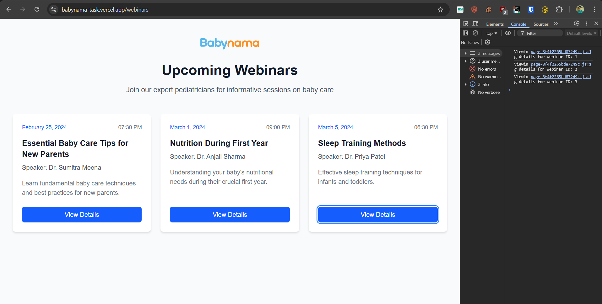

# Babynama - Frontend Developer Intern Assignment

Welcome to the Babynama internship assignment! This short project is designed to simulate a real-world task and help us understand your skills and thought process.

**Objective:** Build a small, self-contained feature in Next.js.  
**Time Allotment:** 2-4 hours.

---

### **Part 1: Getting Started & The Task**

1.  **Repository Setup:** You have already created a repository from this template. Now, install the dependencies:
    ```bash
    npm install
    ```
2.  **The User Story:** Your goal is to implement the following feature:
    > "As a busy parent exploring Babynama's resources, I want to see a simple, clear list of upcoming live webinars on a dedicated page so I can quickly see what's available."

3.  **Your Implementation Tasks:**
    * **Create a Page:** Build a new page at the `/webinars` route.
    * **Display Data:** You don't need an API. Create a mock data array directly in your page file. The array should contain at least three webinar objects, each with an `id`, `title`, `speaker` (e.g., "Dr. Sumitra Meena"), and `date`. Render this data as a list of styled cards on the `/webinars` page.
    * **Add Interactivity:** Add a "View Details" button to each card. When clicked, it should log the `id` of that webinar to the browser's console (e.g., `console.log("Viewing details for webinar ID: 3")`).

---

### **Part 2: Submission**

After you've finished coding, please complete the following two steps.

1.  **Deploy Your Work:** Deploy your project to Vercel (it's free).
2.  **Complete this README:** **This is the most important step.** Edit this `README.md` file in your repository to include:
    * **Live URL:** [https://babynama-task.vercel.app/](https://babynama-task.vercel.app/)
    * **Choices Made:** I implemented a modular component architecture by creating a separate `WebinarCard` component to encapsulate the card's UI and logic. This improves code reusability and maintainability. For the layout, I used a responsive CSS Grid (`grid gap-6 sm:grid-cols-2 lg:grid-cols-3`) to create a clean, mobile-first design. Within each card, I utilized flexbox layout with `flex-grow` and `h-full` classes to ensure consistent button alignment at the bottom, regardless of content length. The component accepts webinar data and click handler as props, making it flexible and reusable across the application.
    * **Roadblock & Learning:** I encountered an issue with Next.js 13+ App Router where event handlers couldn't be passed to server components. I had to research and learn about the "use client" directive, which marks components as client-side components that can handle interactivity. This solved the onClick handler error and allowed the buttons to function properly.
    * **Screenshot:**
        

To submit, please share the link to your finished GitHub repository with us. Good luck!
